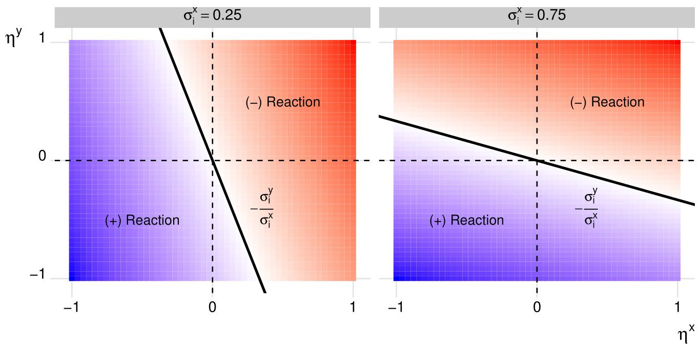
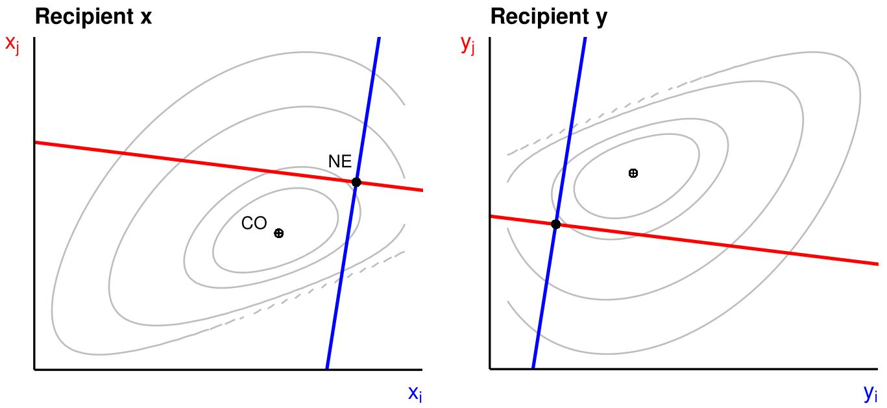
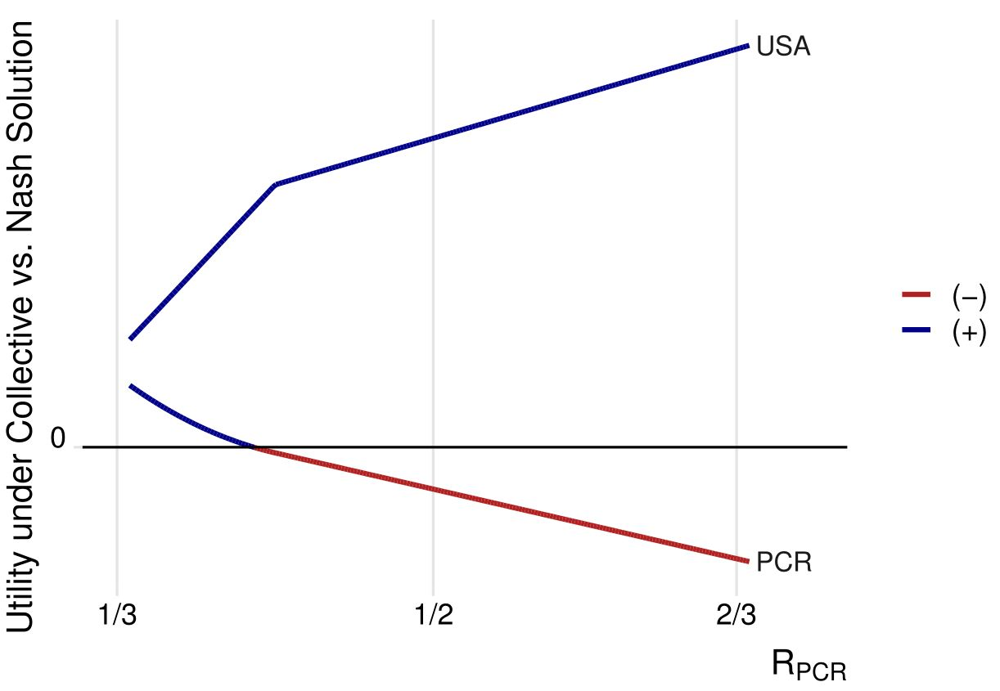

```{r, include=FALSE}
knitr::opts_chunk$set(results = 'asis',
                      echo = FALSE,
                      warning = FALSE,
                      tidy = FALSE,
                      message = FALSE,
                      fig.align = 'center',
                      out.width = "100%")
options(knitr.table.format = "html") 
library(knitr)
```

```{r myplot, include=FALSE}
svg('myplot.svg')
plot(iris$Sepal.Length, iris$Sepal.Width)
dev.off()
```

# Introduction

The empirical approach taken by scholars who study patterns in global development finance aligns quite well with a ubiquitous quote from US President Joe Biden: "Don't tell me what you value. Show me your budget, and I'll tell you what you value."^["Biden's Remarks on McCain's Policies" reported in *The New York Times* on Sep. 15, 2008. Accessed on Mar. 25, 2021. <https://www.nytimes.com/2008/09/15/us/politics/15text-biden.html>]  

International aid has long been a tool that powerful countries wield to effect their designs in international politics. With respect to US foreign policy alone, a cottage industry of studies has used US foreign aid allocations to test competing theories about US goals on the world stage.^[See @fleckKilby2010; @meernikEtAl1998; @mckinlayLittle1977; @mckinlayLittle1979] This line of inquiry extends to Western and Western-allied donor governments and, more recently, to the development financing of the People's Republic of China.^[For an authoritative summary in the Chinese case, see @dreherEtAl2022.]

But, most empirical work proceeds on the basis of a theoretical perspective that ignores _**strategic interdependence**_ in the aid allocation decisions of donor governments. Within the rationalist framework most often adopted by scholars who study the determinants of economic assistance, donors have rational incentives to adjust how they distribute aid in light how others distribute theirs. This means that _**donor governments will often give foreign aid in ways that deviate from how they would give aid on the basis of their foreign policy objectives alone**_.

*What are the implications of strategic interdependence in international aid?* I develop and analyze a theoretical model that helps refine understanding of the implications of strategic interdependence in the political economy of aid. 

```{r, include=FALSE}
knitr::write_bib(c('posterdown', 'rmarkdown','pagedown'), 'packages.bib')
```

# Animating Assumptions and Features

  - The actors of consequence are **donor governments**, treated as unitary and rational actors---meaning they have well-defined preferences and engage in activities with the goal of maximizing their own well-being.
  - Donors operate under a **resource constraint**.
  - Donor activities reflect efforts to realize **multiple** baskets of foreign policy objectives.
  - As donors take steps to maximize their goals, their actions affect and are affected by other actors' efforts to realize their own objectives. Some actions yield **rival** benefits, and other actions yield **common** benefits.
  

# The Model

Suppose a world with two donors, $i$ and $j$, and two recipients, $x$ and $y$. $X_i \geqslant 0$ is the basket of goals realized by $i$ in recipient $x$, and $Y_i \geqslant 0$ is the basket of goals realized by $i$ in recipient $y$. Each is defined as:

$$
\begin{aligned}
X_i & = x_i + \eta^x x_j, \\
Y_i & = y_i + \eta^y y_j.
\end{aligned}
$$

The **externality** parameters $\eta^x, \eta^y \in (-1, 1)$ determine how much a dollar of aid from one donor either supplements or destroys a dollar of aid from the other.

W.L.O.G., utility is expressed as Cobb-Douglas:
$$u_i(X_i, Y_i) = \sigma_i^x\log(X_i) + \sigma_i^y \log(Y_i) \space \text{ s.t. } \space \sigma_i^x + \sigma_i^y = 1, $$
where $\sigma_i^x$ and $\sigma_i^y$ denote the weight $i$ attaches to realizing its goals in $x$ relative to $y$.

Donors seek to maximize utility subject to a resource constraint. For $i$ this is:
$$x_i + y_i \leqslant R_i \space \text{ s.t. } R_i \in (0,1) \space \text{ and } \space R_j = 1 - R_i. $$


# Results

The model is consistent with multiple directions for reaction paths. In fact, one donor may react to the other's aid by giving more where the other gives more. Meanwhile, the other gives less where the one gives more. In either event, giving will deviate from donor priorities. See Figure 1.

```{r, irisfigure, fig.cap='An illustration of how the interaction of priorities over recipients and the strategic valence of donor goals determine whether donors substitute or compete.', out.width="80%"}

```

Across a range of scenarios, a collectively optimal (CO) solution Pareto improves on a Nash equilibrium (NE). See Figure 2.

```{r myprettycode, echo=FALSE,collapse=TRUE, fig.cap='In many cases a collective solution Pareto improves on a Nash equilibrium.', fig.height=3.5, out.width="80%"}

```

However, in many cases collective solutions do not mutually benefit donors. We see this with a hypothetical numerical example. Call donor $i$ the United States and $j$ the People's Republic of China. In this example, the US and China receive rival benefits in recipient $x$ ($\eta^x = -1/2)$ and mutual benefits in recipient $y$ ($\eta^y = 1/2$). The US cares more about $y$ while China cares more about $x$ ($\sigma_{USA}^y = 2/3$ while $\sigma_{PCR}^y = 1/3$). If we shift the share of resources increasingly in China's favor, the US comes to increasingly benefit from a collective solution relative to an uncoordinated Nash equilibrium. However, China comes to increasingly do better in a Nash equilibrium relative to a cooperative solution. See Figure 3.

```{r, echo=FALSE,collapse=TRUE, fig.cap="Pareto improvements are not always guaranteed. This figure illustrates a hypothetical scenario between the United States (USA) and China (PCR). If we shift the dial of resources in China's favor, the US increasingly would benefit from cooperation, but China benefits more by going its own way.", fig.height=3.5, out.width="80%"}

```


# Implications

1. Reactions among donors may be far more complex than standard empirical models are equipped to detect --- _**It's hard to draw reliable inferences about when and where donor goals are rival or common**_.
2. Pareto improvements are not always possible under collectively optimal allocations of aid --- _**Cooperation in the allocation of aid may not always be feasible**_.

# References
